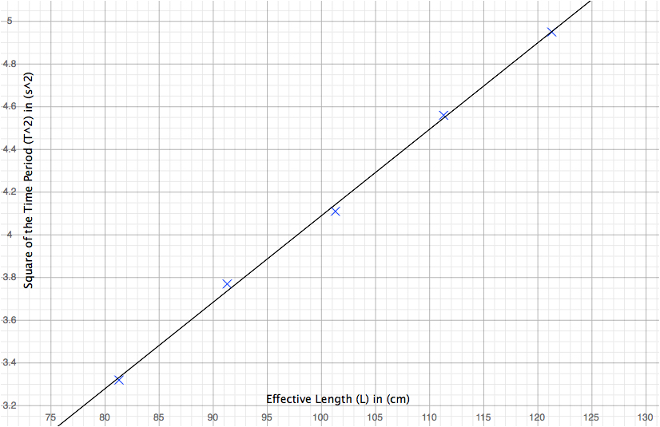

# The Motion of a Simple Pendulum

This is an experiment to observe the variations in the time period of oscillation of a simple pendulum with changes in its effective length. The data gathered will be sufficient to determine an approximate value for the acceleration due to gravity at the site of experimentation.

We already know that given a simple pendulum of effective length $L$, its time period of oscillation $T$ is given by

$$ T = 2\pi\sqrt{\dfrac{L}{g}} $$

where $g$ is the acceleration due to gravity at the site of experimentation. Rearranging the equation to make $g$ its subject, we have

$$ g = 4\pi^2\dfrac{L}{T^2} $$

## Aim
To find the acceleration due to gravity $g$ by measuring the variation in time period $T$ with the effective length $L$ of a simple pendulum.

## Materials Required
* A fixed support to suspend the pendulum from.
* A suitably long strand of inelastic string.
* A moderately heavy mass, preferably spherical such that the position of its centre of gravity is known.
* A device for measuring length (a metre stick).
* A device for measuring time intervals (a stopwatch).

## Method
1. Tie the mass to one end of the string and suspend the other end from the support such that its length is adjustable.
2. Note the distance of the point of contact of the string with the mass and the centre of gravity of the mass as $r$. For a spherical mass, this is simply its radius.
3. Adjust the length of the string to a suitable length $l$.
4. Displace the pendulum from its mean position by a small angle and let go, setting it gently into motion.
5. After allowing a few oscillations to let the time period stabilize, measure the time $T_n$ taken by the pendulum to complete a fixed number of oscillations $n$ abount its mean position.
6. Repeat steps $3$ through $5$ for different values of $l$.
7. Use the data gathered to plot a $T^2$ vs $L$ graph, find its slope, and substitute appropriate values into the given formulae to determine $g$.

## Experimental Data
Radius of spherical mass $r = 1.29\,\mathrm{cm}$

| $l$ in $\mathrm{cm}$ | $L = l + r$ in $\mathrm{cm}$ | $T_{20}$ in $\mathrm{s}$ | $T = \frac{T_{20}}{20}$ in $\mathrm{s}$ | $T^2$ in $\mathrm{s^2}$ |
|-------------:|-----------------------:|------------------:|-------------------------------:|-----------------:|
| 80           | 81.29                  | 36.43             | 1.8216                         | 3.31786225       |
| 90           | 91.29                  | 38.84             | 1.9420                         | 3.77136400       |
| 100          | 101.29                 | 40.56             | 2.0280                         | 4.11278400       |
| 110          | 111.29                 | 42.69             | 2.1345                         | 4.55609025       |
| 120          | 121.29                 | 44.50             | 2.2250                         | 4.95062500       |

On graphing the values for $T^2$ (approximated to 2 d.p.) against $L$, we can see that the points approximate a straight line.

The line of best fit has a slope $\dfrac{\Delta T^2}{\Delta L} \approx 0.0405 \,\mathrm{s^2cm^{-1}} = 4.05 \,\mathrm{s^2m^{-1}}$

## Calculations
We have 
$$ g = 4\pi^2\dfrac{\Delta L}{\Delta T^2} $$
On substituting $\frac{\Delta L}{\Delta T^2}$ with $\frac{1}{4.05}$ and simplifying, we have
$$ g \approx 9.7478 \,\mathrm{ms^{-2}} $$